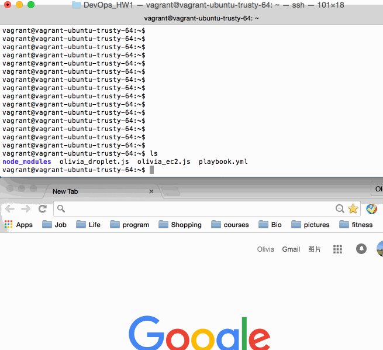

###Introduction
Following steps below, I was able to:   
1. Provision two server: ec2 and droplet using olivia_ec2 and olivia_droplet;    
2. Automatically generate inventory file for both servers;   
3. Ping and install nginx in droplet;   
4. Used npm for node.js, pip for python and apt-get.    
Please contact me if you have any questions:    
name: Ying(Olivia) Huang;
email: yhuang34@ncsu.edu

###Steps
1.use command `ssh-keygen -t rsa -C "oliviahyacinth@gmail.com"` generate public and pirate keys. Rename them as
DevOps_hw1_droplet.pub and DevOps_hw1_droplet.pem  
2.put public key on digitalocean website, generate api token.  
3.put api token after Bearer:
`curl -X GET -H 'Content-Type: application/json' -H 'Authorization: Bearer [token]' "https://api.digitalocean.com/v2/account/keys" `
Get digital ocean ssh_key id from result.   
4.export key and key id into system variable
use `export DO_ACCESS_KEY='[token]'`+`export export DO_ACCESS_KEY_ID='[ssh_key_id]'` 
5.generate key and key id(.csv file) from aws  
6.`export AWS_ACCESS_KEY='[key from aws]'`+`export AWS_ACCESS_KEY_ID='[key id from aws]'`       
10.  open in vagrant virtual box install ansible, nodejs, npm etc.    
11.  `nodejs olivia_ec2.js` firtst, then `nodejs olivia_droplet.js`
12.  run `eval "$(ssh-agent -s)"`+`ssh-add /vagrant/DevOps_hw1_droplet`+`chmod 400 /vagrant/DevOps_hw1_droplet`    
1.  run `ansible-playbook playbook.yml -i inventory`    
13.  remove DevOps_hw1_droplet.pem key.
###Result
There is 1 to 2 minutes pause when I run my javascripts.

